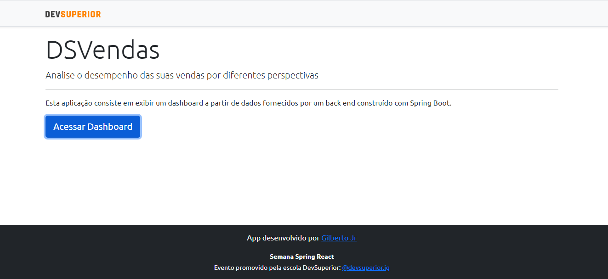
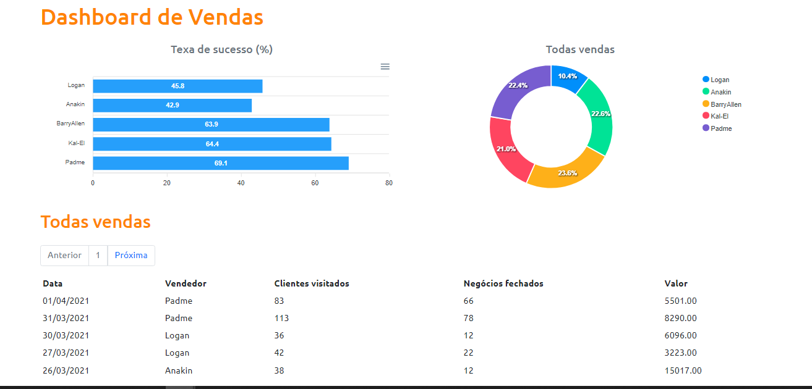

#  Semana Spring React - SDS 3.0

Criamos app inédito com as tecnologias mais demandadas do mercado.

Para fazer o Back-End, usando o Spring Boot do java. E o Front-End usamos o tão querido React Js com o `typeScript`.

O Back-End foi criado através do Spring Boot no `Spring Initializr` com as seguintes dependências:
  - Web
  - JPA
  - H2
  - Postgres
  - Security

```java
	<dependencies>
		<dependency>
			<groupId>org.springframework.boot</groupId>
			<artifactId>spring-boot-starter-data-jpa</artifactId>
		</dependency>
		<dependency>
			<groupId>org.springframework.boot</groupId>
			<artifactId>spring-boot-starter-security</artifactId>
		</dependency>
		<dependency>
			<groupId>org.springframework.boot</groupId>
			<artifactId>spring-boot-starter-web</artifactId>
		</dependency>

		<dependency>
			<groupId>com.h2database</groupId>
			<artifactId>h2</artifactId>
			<scope>runtime</scope>
		</dependency>
		<dependency>
			<groupId>org.postgresql</groupId>
			<artifactId>postgresql</artifactId>
			<scope>runtime</scope>
		</dependency>
		<dependency>
			<groupId>org.springframework.boot</groupId>
			<artifactId>spring-boot-starter-test</artifactId>
			<scope>test</scope>
		</dependency>
		<dependency>
			<groupId>org.springframework.security</groupId>
			<artifactId>spring-security-test</artifactId>
			<scope>test</scope>
		</dependency>
	</dependencies>
```

### Estruturar o projeto em camadas. Padrão camadas adotado.
- Criar repositories
- Criar DTO's
- Criar service
- Criar controller


Para criar o Front-End 

### Dependência.

```javascript    
    "@popperjs/core": "^2.9.2",
    "@testing-library/jest-dom": "^5.11.4",
    "@testing-library/react": "^11.1.0",
    "@testing-library/user-event": "^12.1.10",
    "@types/jest": "^26.0.15",
    "@types/node": "^12.0.0",
    "@types/react": "^17.0.0",
    "@types/react-dom": "^17.0.0",
    "apexcharts": "^3.26.2",
    "axios": "^0.21.1",
    "bootstrap": "^5.0.0",
    "data-fns": "^0.1.8",
    "date-fns": "^2.23.0",
    "react": "^17.0.2",
    "react-apexcharts": "^1.3.9",
    "react-dom": "^17.0.2",
    "react-router-dom": "^5.2.0",
    "react-scripts": "4.0.3",
    "typescript": "^4.1.2",
    "web-vitals": "^1.0.1"
```

### Dependência de Desenvolvimento.

```javascript    
    "@types/react-router-dom": "^5.1.8"
```

## O projeto vai integrar back-end e front-end através de:
- Três pilares do React
  - Componentes
  - Props
  - Estado
- React Hooks
  - useState
  - useEffect
- Libs
  - React Router DOM
  - Axios


# ScreenShot

## Página - Home
<p align="center">

</p>

## Página - Dashboard
<p align="center">

</p>
<h1 align="center">💻 Desenvolvido Por: Gilberto Júnior</h1>